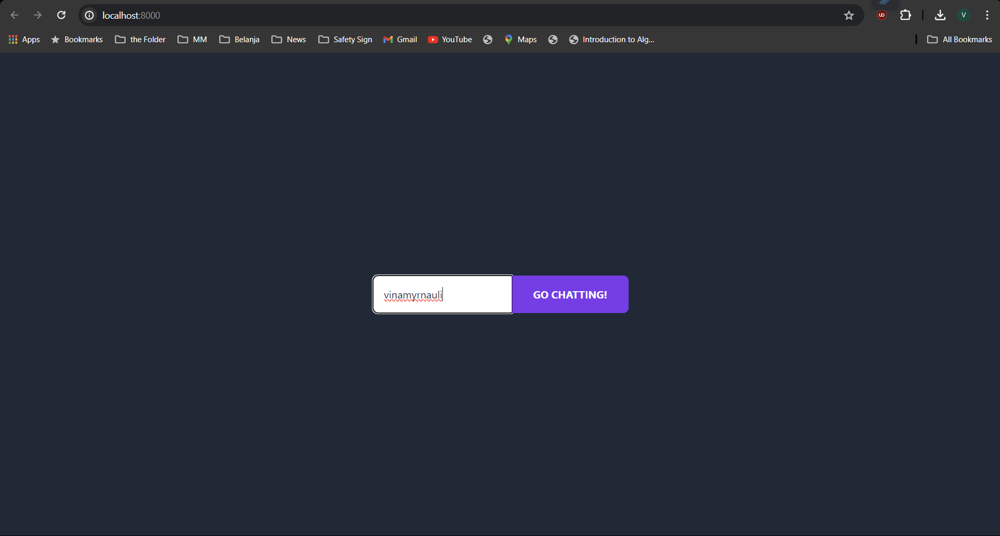
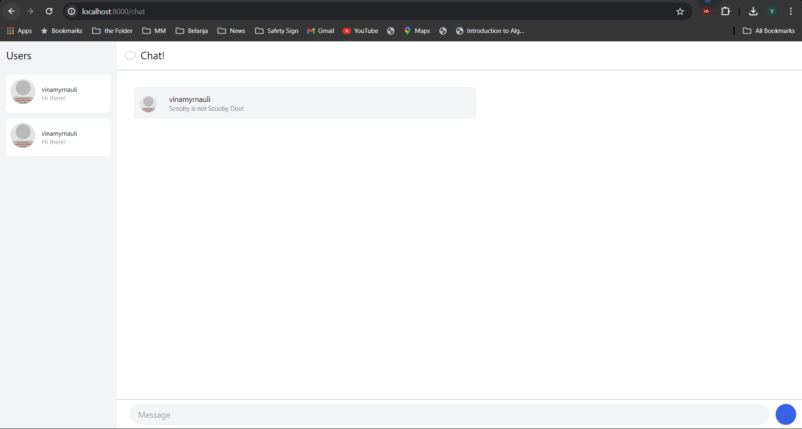
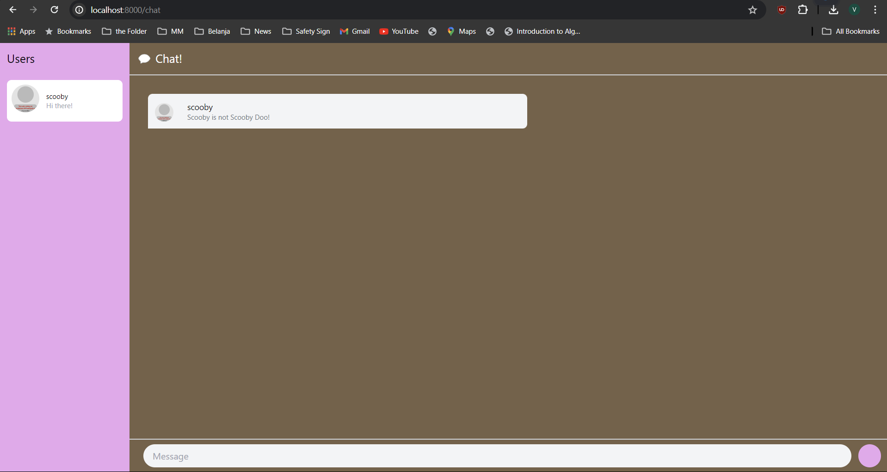

# Tutorial 10 (YewChat)
Nama: Vina Myrnauli Abigail Siallagan<br>
NPM: 2206825776<br>
Kelas: Pemrograman Lanjut - A<br>

---
## REFLEKSI 3

###### 3.1. Original code.
 
  
<br>

###### 3.2. Add some creativities to the webclient.
  
* Saya membuat tema kustom cokelat-pink.

<hr>

# YewChat 💬

> Source code for [Let’s Build a Websocket Chat Project With Rust and Yew 0.19 🦀](https://fsjohnny.medium.com/lets-build-a-websockets-project-with-rust-and-yew-0-19-60720367399f)

## Install

1. Install the required toolchain dependencies:
   ```npm i```

2. Follow the YewChat post!

## Branches

This repository is divided to branches that correspond to the blog post sections:

* main - The starter code.
* routing - The code at the end of the Routing section.
* components-part1 - The code at the end of the Components-Phase 1 section.
* websockets - The code at the end of the Hello Websockets! section.
* components-part2 - The code at the end of the Components-Phase 2 section.
* websockets-part2 - The code at the end of the WebSockets-Phase 2 section.
